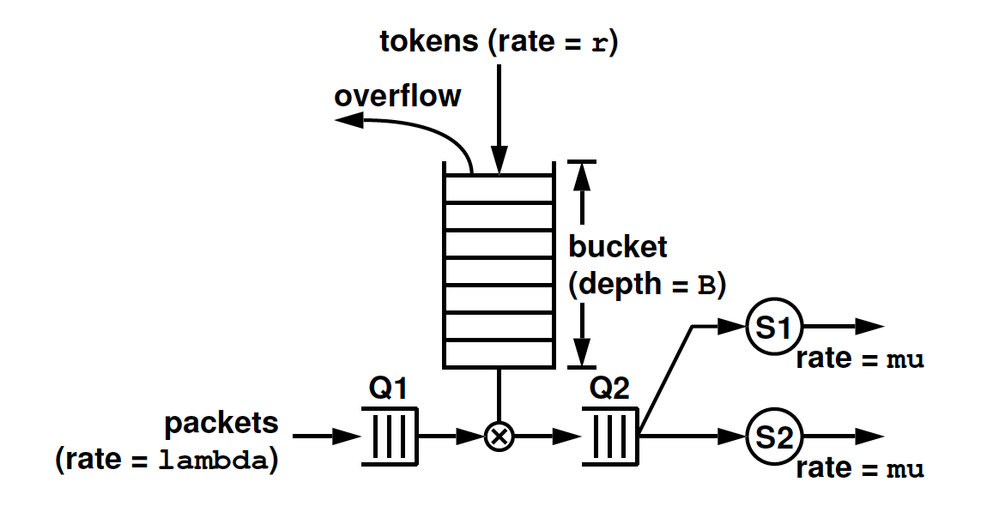

# Token Bucket Filter
Emulation of a toket bucket filtering system using a linked list of packets.

## Description
The multi-threaded program simulates a traffic shaper that uses a token bucket filter to control the flow of packet transmission. Arriving packets from our input file are placed in a wait queue and sent to the server queue when there are enough tokens in the token bucket for the arriving packets. Two servers are simultaneously run to process the packets in the server queue. Results and statistics of the runs are subsequently outputted. 

In this multi-threaded program, every object is a thread. In addition to the main thread, there are four additional threads: a packet arrival thread that creates the packet and sends it to the wait queue, a token depositing thread that increments the token bucket and checks if the token requirements are fulfilled to move the packet from the wait queue to the server queue, and two server threads that transmit the packet from the server queue to their respective servers. Coordination between the 4 threads are required via mutexes to determine which threads are active and which threads are asleep. The cases of dropped tokens and dropped packets are handled by this program. Additionally, there is an option to gracefully kill the program with ctrl + c. A SIGINT signal is sent to let the running threads know to end their work at a reasonable stopping point. 

